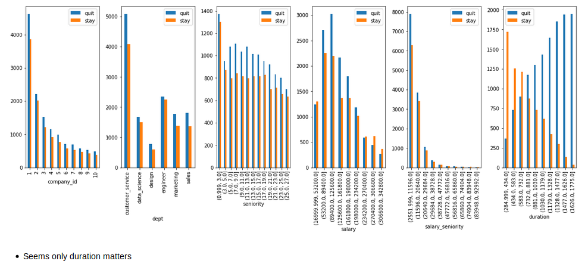
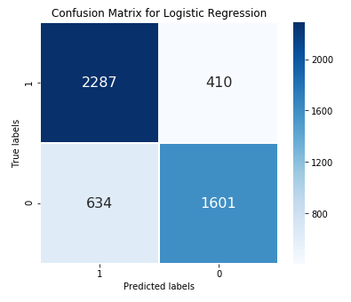
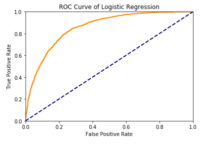
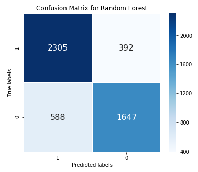
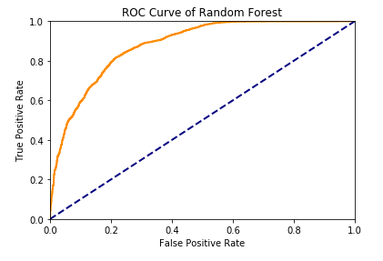
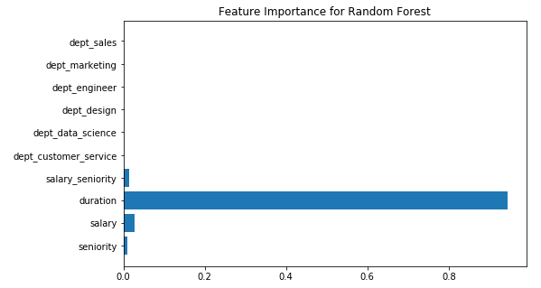
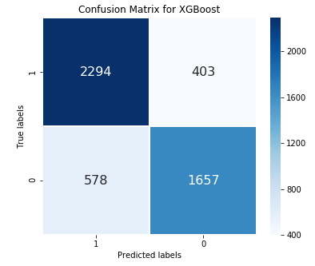
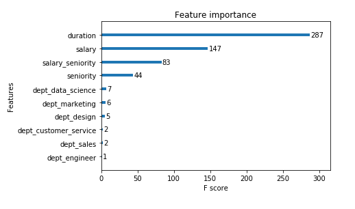

# Quit_or_stay
Built classifer to figure out who will quit.

## Goal

You belong to the people analytics team for a food conglomerate. Employee turnover has been rampant for your 10 subsidiaries. The CFO estimates that the cost of replacing an employee is often larger than 100K USD, taking into account the time spent to interview and find a replacement, placement fees, sign-on bonuses and the loss of productivity for several months.

Your team has been tasked with diagnosing why and when employees from your subsidiaries leave. You need a tangible data-driven recommendation for each of the ten Presidents of your subsidiaries. What are your recommendations and why?
## Details

We got employee data from a few companies. We have data about all employees who joined from 2011/01/24 to 2015/12/13. For each employee, we also know if they are still at the company as of 2015/12/13 or they have quit. Beside that, we have general info about the employee, such as average salary during her tenure, department, and years of experience. As said above, the goal is to predict employee retention and understand its main drivers
Data

## Approches

* Logistic Regression Classifier
* Random Forest Classifier
* XGBoost based classifier
* T-testing

## Data fields:

    * employee_id : id of the employee (unique by employee per company)
    * company_id : company id
    * dept : employee department
    * seniority : number of yrs of work experience when hired
    * salary: average yearly salary of the employee during her tenure within the company
    * join_date: when the employee joined the company, it can only be between 2011/01/24 and 2015/12/13
    * quit_date: when the employee left her job (if she is still employed as of 2015/12/13, this field is NA)

## 1. EDA
After data cleaning and wrangling. Below is the overview of the dataset.

## 2.1 Logistic Regression Classifier

## 2.2 Random Forest Classifier

## 2.3 XGBoost based classifier

